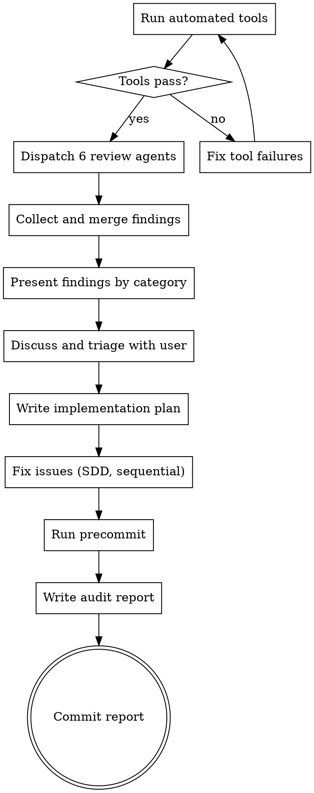

# Deep Clean

Comprehensive codebase health audit combining automated tooling with parallel agent-driven review across 7 domains.

## When to Use

- After completing a milestone or batch of features
- When you suspect architectural drift or accumulated tech debt
- Before a major release as a final quality check
- Whenever the codebase needs a thorough checkup

## When NOT to Use

- For reviewing a single PR or change (use requesting-code-review instead)
- When the build is broken (fix it first)
- For debugging a specific issue (use systematic-debugging instead)

## Process



### Step 1: Automated Baseline

Run the project's quality gate. For this project: `pnpm precommit` (typecheck, lint, knip, tests). If any tool fails, fix before proceeding. Don't audit a broken build.

### Step 2: Parallel Agent Dispatch

Dispatch 7 agents concurrently using the Agent tool, one per domain. Each agent gets:
- Its domain-specific prompt template (see agent prompt files in this directory)
- The automated tool output summary
- Instructions to read broadly, not spot-check

**These agents are read-only reviewers.** They explore code and report findings — they do not write code or make changes. No worktree isolation is needed.

**Domains:**
1. **Architecture & Design** — Module boundaries, patterns, dependency direction
2. **Security** — Input validation, injection risks, data exposure
3. **Performance** — Query patterns, rendering, hot paths, caching
4. **Code Quality** — Dead code, duplication, complexity, naming
5. **Test Quality** — Meaningful assertions, coverage gaps, mock fidelity
6. **Documentation** — CLAUDE.md and README.md accuracy against codebase and plan docs
7. **Data Flow** — Data fracturing, duplication, unnecessary fetches, stale data after mutations, fragile state chains

Use `subagent_type: "general-purpose"` for all agents. Each agent prompt is in this skill directory.

### Step 3: Report Assembly

Collect findings from all 7 agents. Deduplicate — if two agents flag the same file/issue, keep the more specific finding and note which domains identified it. When agents disagree on severity, use the higher severity.

Organize findings into a flat table by category, with a severity column. This is more scannable than nested severity sub-headings:

```
| # | Severity | Finding | File(s) |
|---|----------|---------|---------|
| 1 | Important | Two wilsonInterval implementations with incompatible signatures | wilsonInterval.ts, utils.ts |
```

### Step 4: Present and Triage

Present findings to the user category by category. For each finding, include:
- File path and line reference
- Description of the issue
- Why it matters
- Severity classification

Discuss with the user. They may:
- Reclassify severity
- Dismiss false positives
- Defer items
- Add specific implementation guidance (e.g., "use generic error messages for security validation")

This step is essential — don't skip it and go straight to fixing.

### Step 5: Write Implementation Plan

After triage, write a full implementation plan using the `superpowers:writing-plans` skill. This is not optional — it was the most valuable step in practice.

The plan should:
- Group fixes into independent tasks, one commit per task
- Order tasks by dependency (shared utilities first, then consumers, then tests)
- Define chunks for parallel execution where tasks are truly independent
- Include specific file lists and code snippets for each task
- Note which tasks depend on others

Save the plan to `docs/superpowers/plans/YYYY-MM-DD-deep-clean-fixes.md`.

### Step 6: Execute Fixes

Use subagent-driven development (SDD) to execute the plan. **Execute agents sequentially in the main repo** — do not use worktree isolation. Each task should produce one self-contained commit.

Why sequential, not parallel worktrees:
- Tasks often touch overlapping files (imports, shared modules)
- Cherry-picking worktree commits back causes merge conflicts
- Agents in worktrees work against stale code when earlier tasks change shared APIs
- Sequential execution is slower but reliable

Run the project's quality gate (`pnpm precommit`) after each commit to catch issues early.

### Step 7: Audit Report

After all fixes pass precommit, write the final report to `docs/audits/YYYY-MM-DD-deep-clean.md`:

```markdown
# Deep Clean Audit Report — YYYY-MM-DD

**Branch:** `branch-name` (N commits, M files changed, +A / -B lines)

## Summary

One paragraph describing the scope and outcome.

## Findings by Category

### Architecture (N fixes)

| # | Severity | Finding | Fix |
|---|----------|---------|-----|
| 1 | Important | Description of what was found | What was done to fix it |

### Security (N fixes)
(same table structure)

### Performance (N fixes)
(same table structure)

### Code Quality (N fixes)
(same table structure)

### Test Quality (N fixes)
(same table structure)

### Documentation (N fixes)
(same table structure)

### Data Flow (N fixes)
(same table structure)

## Test Impact

- **Before:** X tests (Y passing, Z skipped)
- **After:** X tests (Y passing, Z skipped)
- **New test files:** list
- **Enhanced test files:** list

## New Modules

| File | Purpose |
|------|---------|
| path/to/file.ts | What it does |

## Not Addressed

Items considered but intentionally left alone, with reasoning.
```

Commit the report to git.

## Common Mistakes

- **Auditing a broken build** — Fix tool failures first. Agents will waste time on issues the tools would catch.
- **Treating everything as critical** — Use severity levels honestly. If everything is critical, nothing is.
- **Skipping triage** — The user should review and discuss findings before fixes begin. False positives waste effort.
- **Fixing without a plan** — The plan step organizes tasks by dependency, prevents conflicts, and gives the user a final review point before implementation begins.
- **Using worktree isolation for fixes** — Parallel worktrees cause merge conflicts when tasks touch overlapping files. Execute sequentially in the main repo instead.
- **Skipping precommit between tasks** — Each task should pass the quality gate independently. Don't batch fixes and hope they work together.

## Agent Prompt Templates

Each agent has a dedicated prompt template in this directory:
- `architecture-agent.md`
- `security-agent.md`
- `performance-agent.md`
- `code-quality-agent.md`
- `test-quality-agent.md`
- `documentation-agent.md`
- `data-flow-agent.md`
